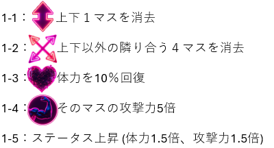

# HexaPuzzle

## ゲーム説明
### 概要
このゲームはマウスで操作するパズルゲームです。
6角形のマスをクリックし、クリックしたマスと同じ色が繋がっているほど敵にダメージを与えることができます。

### スキルについて
敵を撃破すると一定確率でアイテムをドロップ！
敵の種類に応じて様々なスキルが登場！！！

画像のあるスキルはパズルのマスに付与されるスキル、画像のないスキルはステータスに影響するスキルです。

## 開発環境
Processing 4.4.4
